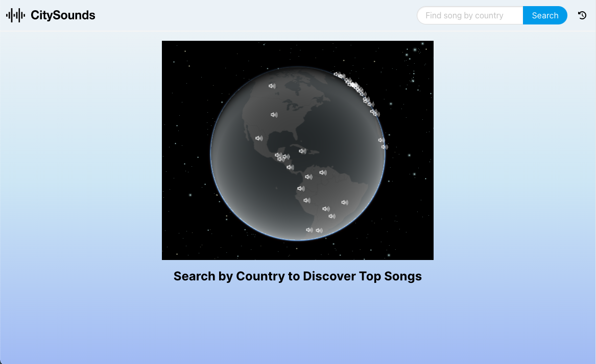
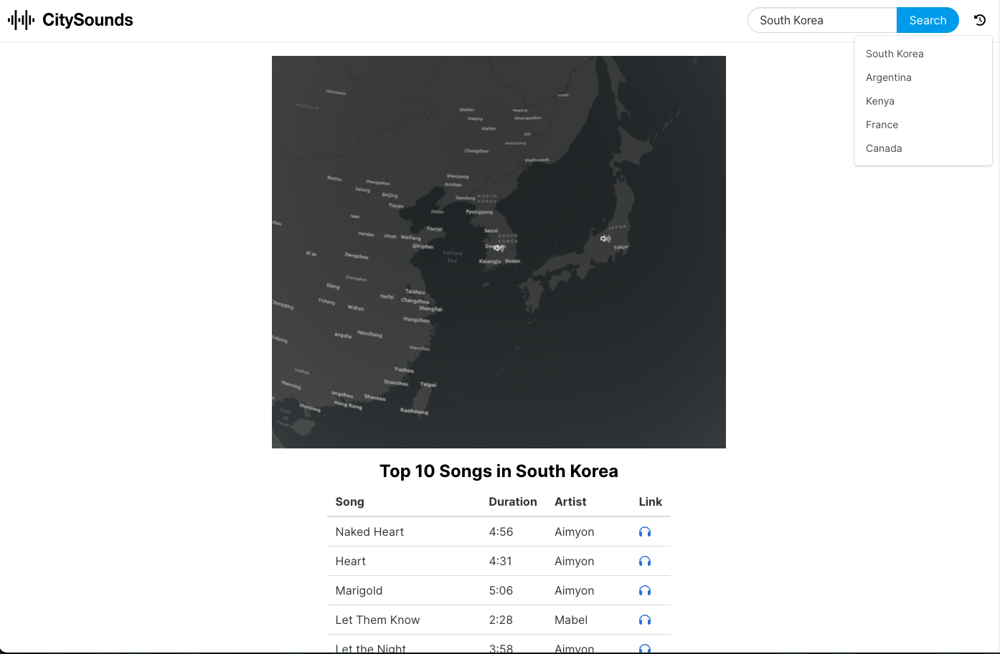
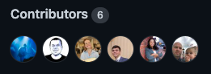

# CitySounds

## Description

Our team's motivation for creating this application was to apply a culmination of our knowledge thus far in our bootcamp. That includes HTML, CSS, JavaScript, third-party APIs, and most recently, Git. Each team member wanted to exercise their strengths and improve upon other skills. All of us used this project as an opportunity for teach-backs and, in turn, to learn more about areas of programming that we haven't explored deeply yet. 

In the beginning, our goal was to create an impressive end product that we could realistically use and be proud to display in our portfolios. The process of brainstorming, planning, and developing our app was important in our decidion making process. We decided that it was much better to deliver a polished MVP that we could knowingly develop given the time constraints, than overshoot our goal for the time and resources currently available to us. We gained invaluable experience working in Github collaboratively, using Git to push code made in branches, pull from the main repo, and merge pull requests to remain in sync with one another. Throughout development, we learned the importance of communication. While a team member works on one function, another person's area of the application may depend on variables defined in that function. Changing even the smallest lines of code could have large scale impacts. Each of us learned about different areas of coding from various team members. 

Despite realizing we could not add every bell and whistle we originally wanted, our team is proud to deliver the [final app](https://jandreassi.github.io/city-sounds/) we have. CitySounds allows people to search by country for the top ten songs in 69 nations with a sleek, easy to navigate user interface. 

## Installation 

To use this app, please [click here](https://cors-anywhere.herokuapp.com/corsdemo) to initialize our temporary proxy server. This will enable access to Deezer's (our music API's) data!

[Click here](https://jandreassi.github.io/city-sounds/) for the deployed application.

## Usage

Before using this application, please [click here](https://cors-anywhere.herokuapp.com/corsdemo) to initialize our temporary proxy server in order to access Deezer's (our music API's) data!

Upon the landing page loading, simply type a country name into the search bar in the top right corner. Click the autofill option, then click search Clicking search will show you the current top ten songs in that country!

To view the top ten songs from a country you have previously searched, click the recent searches icon    in the upper right corner.

View our deployed application [here](https://jandreassi.github.io/city-sounds/)

## Credits

Find each group member's github link below:

[Elias Spector-Zabusky](https://github.com/ColdWeatherBoyy), [Colin Sprows](https://github.com/ColinSprows), [Liza Parr](https://github.com/lparr30), [Joseph Reis](https://github.com/JosephReis646), [Tatiana Castro](https://github.com/tatys5394), [Jared Andreassi](https://github.com/jAndreassi)

Third-party assets:

We used [Deezer's API](https://developers.deezer.com/) to access the top ten songs in each country. Deezer requires a login to view API information. 
We used [ArcGIS Maps](https://developers.arcgis.com/javascript/latest/) to read documentation on how to implement the map. 
The [ArcGIS map view](https://developers.arcgis.com/javascript/latest/api-reference/esri-views-MapView.html) feature allowed our team to display an interactive globe on the webpage.

## License

Please see the repo for license info.
